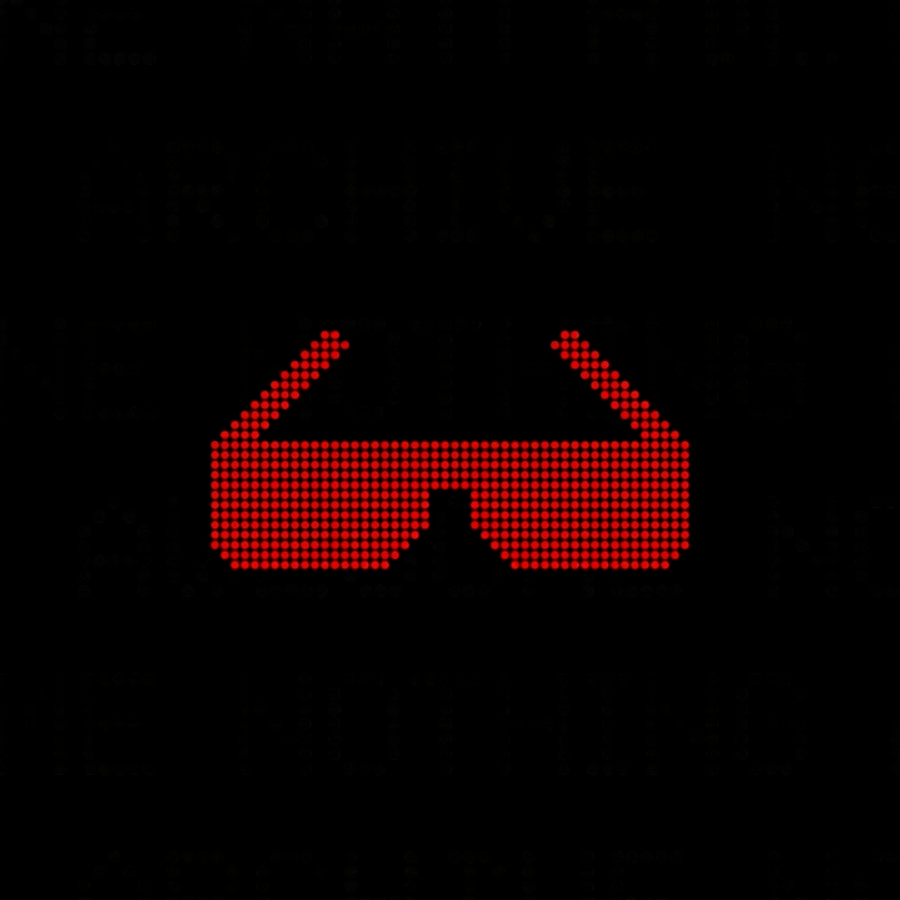

  
  <h1>Nothing Archive</h1>
  
Your ultimate source for Nothing OS firmware, stock OTA images, and comprehensive guides for Nothing & CMF by Nothing devices.

   

   
  ••••••••••••••••••••••
   

## Support the Project

If this project helps you, please consider [starring  the repository](https://github.com/spike0en/nothing_archive/stargazers). It helps with discoverability and encourages maintenance. Thank you!

  <picture>
    <source media="(prefers-color-scheme: dark)" srcset="https://api.star-history.com/svg?repos=spike0en/nothing_archive&type=Date&theme=dark" />
    <source media="(prefers-color-scheme: light)" srcset="https://api.star-history.com/svg?repos=spike0en/nothing_archive&type=Date" />
    
  </picture>

   
  ••••••••••••••••••••••
   

## Overview

Nothing Archive is the most up-to-date Nothing OS firmware repository, offering official OTA updates, full firmware packages, and stock OTA images for Nothing and CMF by Nothing phones. All files are sourced directly from official OEM servers and [archived](https://archive.org/details/nothing-archive) for long-term preservation and easy access. 

Beyond firmware, the project indexes community-made apps, tools, projects, official resources, aftermarket development initiatives, and more, thus serving as an all-in-one curated hub for everything related to the Nothing & CMF ecosystem.

  ••••••••••••••••••••••

## Contents

- **[Devices](https://spike0en.github.io/nothing_archive/docs/devices)**: Complete catalog of Nothing & CMF products
- **[Firmware Archive](https://spike0en.github.io/nothing_archive/docs/firmware)**: Nothing OS firmware, stock factory images, and delta OTA files
- **[OTA Changelogs](https://spike0en.github.io/nothing_archive/docs/changelogs)**: Official Nothing OS update changelogs, feature updates, bug fixes, and version history
- **[Guides](https://spike0en.github.io/nothing_archive/docs/guides)**: Comprehensive step-by-step tutorials on several aspects
- **[Official Resources](https://spike0en.github.io/nothing_archive/docs/official)**: OEM apps, SDKs, wallpapers, fonts and more
- **[Community Apps](https://spike0en.github.io/nothing_archive/docs/apps)**: Glyph-powered apps, productivity tools, and utilities
- **[Projects](https://spike0en.github.io/nothing_archive/docs/projects)**: Community built projects, creative software and utilities
- **[Photography](https://spike0en.github.io/nothing_archive/docs/photography)**: GCAM ports, configs, and stock camera presets

  ••••••••••••••••••••••

## Contributing

We welcome community contributions! If you'd like to help improve the documentation, add new apps, or write guides, please read our [Contributing Guidelines](CONTRIBUTING.md) to get started.

  ••••••••••••••••••••••

## Licensing

The Nothing Archive project is multi-licensed to protect both the code and community contributions:

- **Automation & Website Code**: [MIT](LICENSE-MIT)
- **Documentation & Translations**: [CC BY-NC 4.0](LICENSE-CC-BY-NC-4.0) (All `.md` files)
- **Project Branding**: CC BY-NC-ND 4.0 (All image files under `website/static/img`)
- **Third-party Tools**: See [bin/README.md](bin/README.md) for attribution.

For a detailed breakdown of what each license covers, please refer to the [LICENSE](LICENSE) file.

  ••••••••••••••••••••••

## Acknowledgements

Special thanks to:
- **[luk1337](https://github.com/luk1337/oplus_archive)** for the AOSP OTA extraction tool.
- **[arter97](https://github.com/arter97/nothing_archive)** for adapting the archive for Phone (2).
- **[Shiki](https://github.com/guptavishal-xm1)** for crafting the initial website for the repo.
- **[EdwardWu](https://github.com/bluehomewu)** for zh‑TW translations and maintenance of the [docs](https://github.com/spike0en/nothing_archive/tree/main/website/i18n/zh-TW/docusaurus-plugin-content-docs/current).
- **[Daniel Springer](https://github.com/Daniel210191)** for providing self-hosted runner instances.
- **[XelXen](https://github.com/XelXen) & [Tor](https://github.com/torharrington)** for helping with [project branding and design](https://github.com/spike0en/nothing_archive/tree/main/website/static/img).
- **[LukeSkyD](https://xdaforums.com/t/nothing-phone-1-repo-nos-ota-img-guide-root.4464039/)** for early build references.
- **[Project Contributors](https://github.com/spike0en/nothing_archive/graphs/contributors)** for their invaluable contributions and insights.

  ••••••••••••••••••••••

