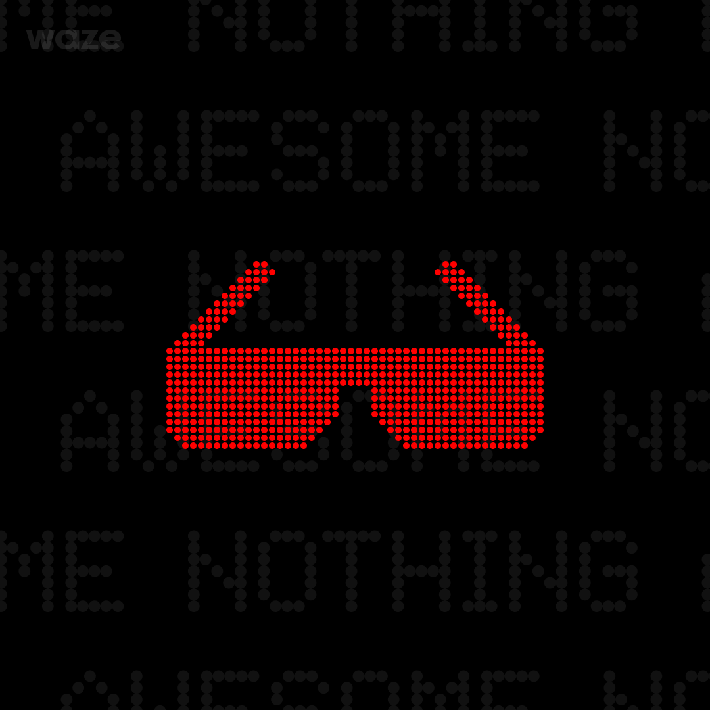

  <h1>Awesome Nothing</h1> 
A curated list of everything related to Nothing & CMF by Nothing ecosystem.

 

  
  
  
## Support the Project

If this index is helpful, please consider [starring  the repository](https://github.com/spike0en/awesome_nothing/stargazers). It helps with discoverability and encourages maintenance. Thank you!

  <picture>
    <source media="(prefers-color-scheme: dark)" srcset="https://api.star-history.com/svg?repos=spike0en/awesome_nothing&type=Date&theme=dark" />
    <source media="(prefers-color-scheme: light)" srcset="https://api.star-history.com/svg?repos=spike0en/awesome_nothing&type=Date" />
    
  </picture>

## Contents

- **[Devices](https://spike0en.github.io/awesome_nothing/docs/devices)** — Complete catalog of Nothing & CMF products
- **[Community Apps](https://spike0en.github.io/awesome_nothing/docs/apps)** — Glyph-powered apps, Glyph Matrix toys, productivity tools, and utilities
- **[Projects](https://spike0en.github.io/awesome_nothing/docs/projects)** — Glyph tools, modules, and more
- **[Official Resources](https://spike0en.github.io/awesome_nothing/docs/official)** — OEM apps, SDKs, wallpapers, and fonts
- **[Photography](https://spike0en.github.io/awesome_nothing/docs/photography)** — GCAM ports, configs, and stock camera presets
- **[Guides](https://spike0en.github.io/awesome_nothing/docs/guides)** — Tutorials regarding several aspects

## Acknowledgements

- [Project Contributors](https://github.com/spike0en/awesome_nothing/graphs/contributors) for their invaluable contributions and insights.
- [Shiki](https://github.com/guptavishal-xm1) for all help with crafting the website for the repo.
- All the **creators, project maintainers, and community members** working behind the scenes on various Nothing-related projects. Their efforts, whether direct or indirect, have helped make this project possible.

## License

-  This project is licensed under [CC0 1.0 Universal](https://creativecommons.org/publicdomain/zero/1.0/).
